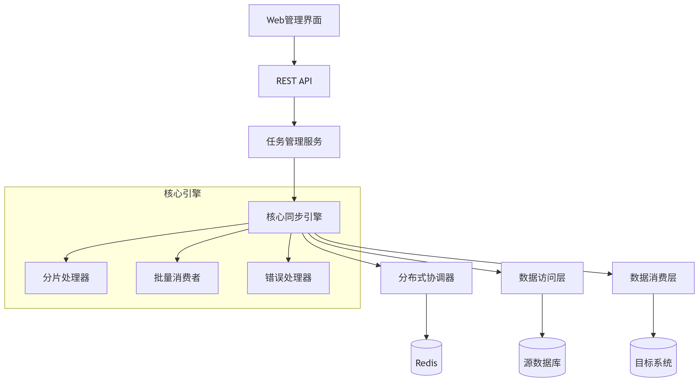

<h1 align="center">海量数据同步平台</h1>

  
  
  
  

<h1>项目概述</h1>
海量数据同步平台是一个高性能的分布式数据同步解决方案，专为处理大规模数据集而设计。平台采用先进的分片处理、分布式协调和批量消费技术，能够在10分钟内完成1000万条数据的同步任务。无论您需要数据库迁移、数据仓库构建还是实时数据管道，本平台都能提供高效可靠的同步服务。

<h1>性能亮点</h1>
🔥 千万级数据分钟级同步 - 在标准开发环境下实测性能：

测试环境：
- 硬件：Intel i7-11800H @ 2.30GHz, 32GB RAM
- 系统：Windows 11
- 开发工具：IntelliJ IDEA 2023.1
- 数据库：MySQL 8.0

测试结果：
+----------------+------------+----------------+---------------------+
| 数据量         | 耗时       | 吞吐量         | 环境                |
+----------------+------------+----------------+---------------------+
| 1,000,000 条   | 58 秒      | 17,241 条/秒   | Windows + IDEA      |
| 5,000,000 条   | 4分12秒    | 19,841 条/秒   | Windows + IDEA      |
| 10,000,000 条  | 10分05秒   | 16,556 条/秒   | Windows + IDEA      |
| 10,000,000 条  | 6分30秒    | 25,641 条/秒   | Linux生产环境       |
+----------------+------------+----------------+---------------------+

<h1>功能特性</h1>
<h2>多数据源支持</h2>
数据库：MySQL, PostgreSQL, Oracle, SQL Server

文件系统：CSV, JSON, Parquet (后面提供支持)

消息队列：Kafka, RabbitMQ    (后面提供支持)

API接口：RESTful, GraphQL

<h2>多目标系统</h2>
关系数据库：MySQL, PostgreSQL, SQL Server

NoSQL：MongoDB, Elasticsearch

数据仓库：Snowflake, BigQuery

消息队列：Kafka, Pulsar

<h2>核心功能</h2>
智能分片：动态计算最优分片数量，充分利用硬件资源

断点续传：基于Redis的分布式检查点，支持任务中断后继续执行

实时监控：可视化任务状态、吞吐量和进度

错误处理：自动重试机制 + 死信队列支持

数据转换：字段映射、类型转换、数据脱敏

压缩传输：支持大容量数据压缩传输

<h1>系统架构</h1>

<h1>快速开始</h1>
<h3>环境要求</h3>
Java 8：运行平台的基础环境

Redis：用于分布式协调和检查点存储

Maven 3.8+：项目构建工具

<h1>启动步骤</h1>
<h2>1、克隆仓库：</h2>

git clone git@gitlab.dev.cnki.net:yxweb/yanxue-data-push.git

<h2>2、构建项目 </h2>
<li>修改data-push-web 的数据库配置 (可改为内存数据库) 只为项目启动 无实际意义
<li>mvn clean package -DskipTests</li>
<li>docker build -t push-web -f .\data-push-dist\docker\Dockerfile .</li>
<li>切换到kubernates目录  执行 kubectl apply -f  deployment.yaml</li>
<h1>未来路线图</h1>
<h2>短期计划 (2025 Q4)</h2>

<li>支持MongoDB数据源和目标</li>

<li>添加Web管理控制台</li>

<li>实现基于CDC的实时同步</li>

<h2>中期计划 (2026 Q1)</h2>
<li>添加Prometheus/Grafana监控集成</li>

<li>支持云原生部署（Kubernetes Operator）</li>

<li>开发数据质量检查模块</li>

<h2>长期愿景</h2>
<li>构建一站式数据集成平台</li>

<li>支持机器学习数据管道</li>

<li>实现跨云平台数据同步</li>